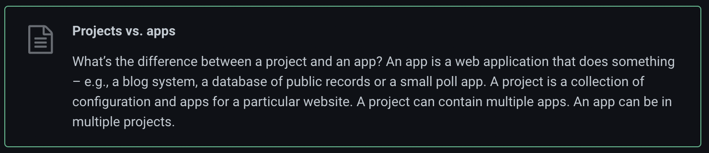
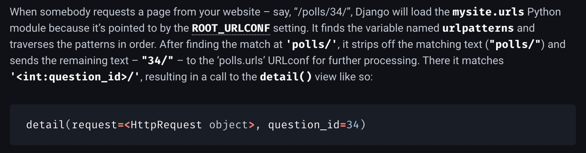

# Learn Django

## Why Django?

For some reason I *have* to learn how to build UI apps so I can develop small little utilities. My alternative are:

* Native apps - cannot be easily shared but can look very pretty and full featured
  * Mac OS - requires learning Swift and the MacOS UI DSL
  * Electron - requires learning Javascript, Typescript, Electron framework, and some CSS framework
  * React Native - requires learning Javascript, Typescript, React framework, and some CSS framework
  * Kiva - requires learning Kiva UI DSL
* SPA web apps - can be shared easily, relatively snappy, but not as full featured
  * React JS - requires learning Javascript, Typescript, React framework, and some CSS framework
  * Vue JS - requires learning Javascript, Typescript, Vue framework, and some CSS framework
* Web apps - can be shared easily, not very snappy, not as full featured
  * Django - requires learning Django framework and some CSS framework

With Django I have to learn the minimum amount of stuff, and most importantly no new language to learn. I want to keep my language learning limited to Julia and Haskell. No point cluttering my brain with Javascript.

## Useful Snippets

