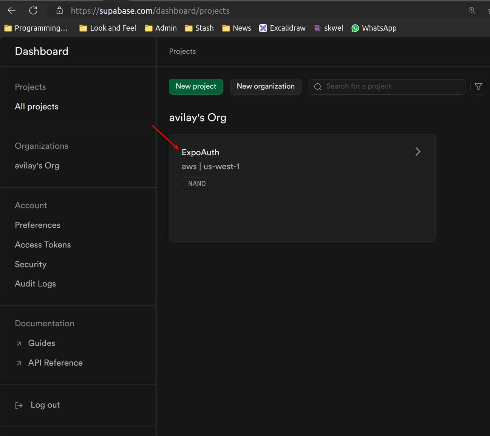
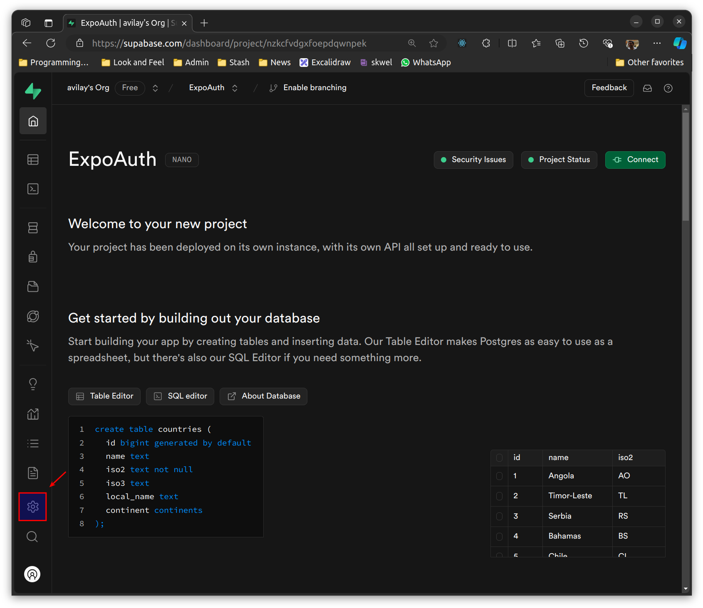
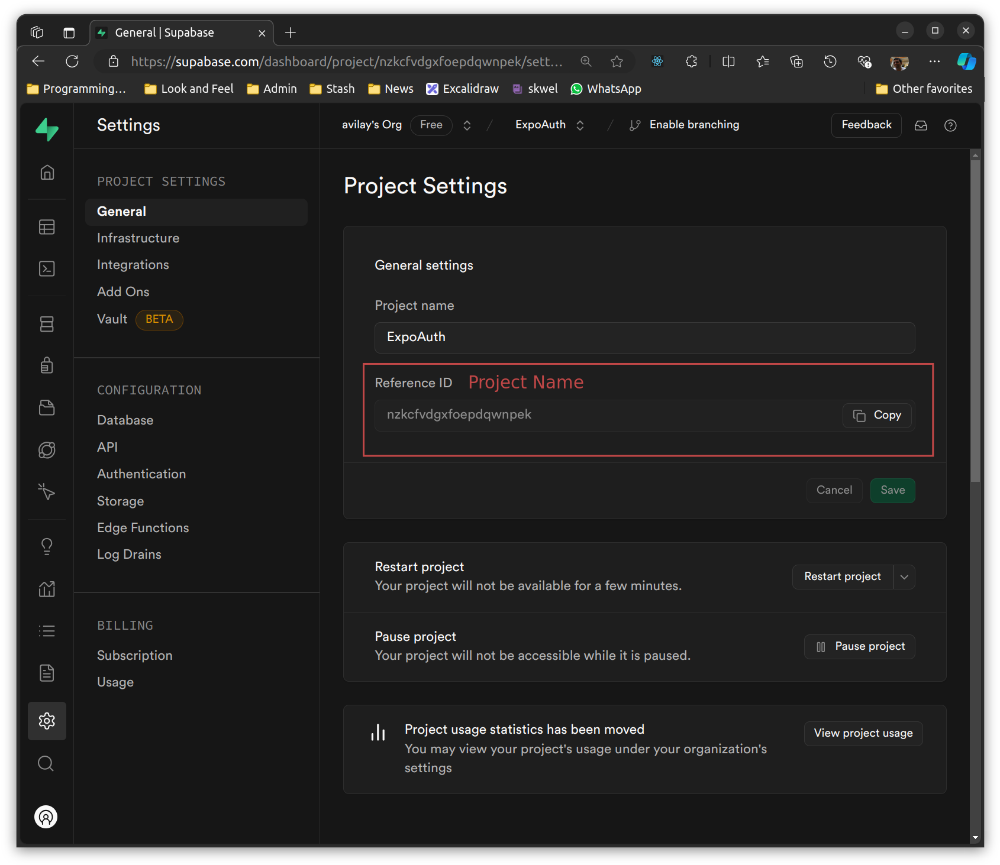
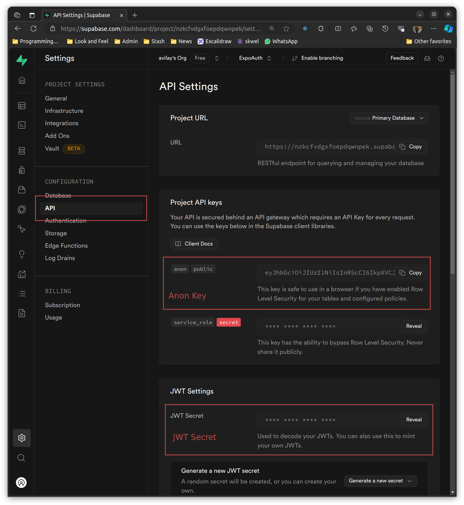
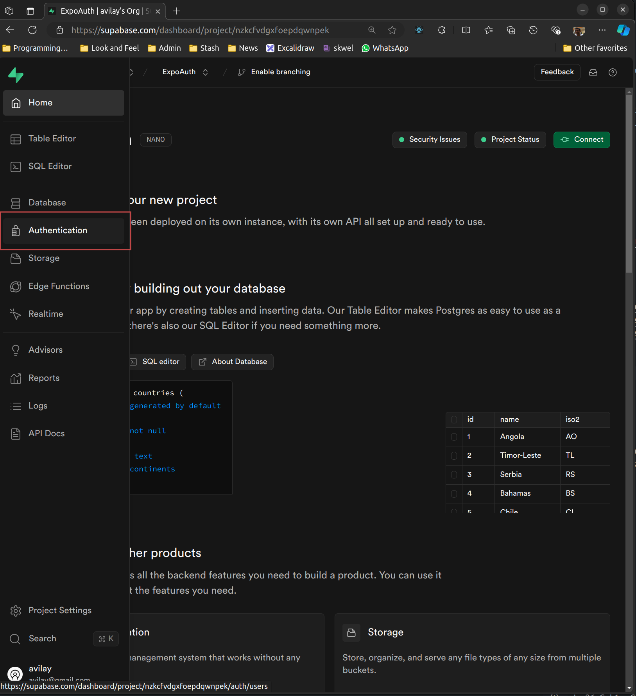
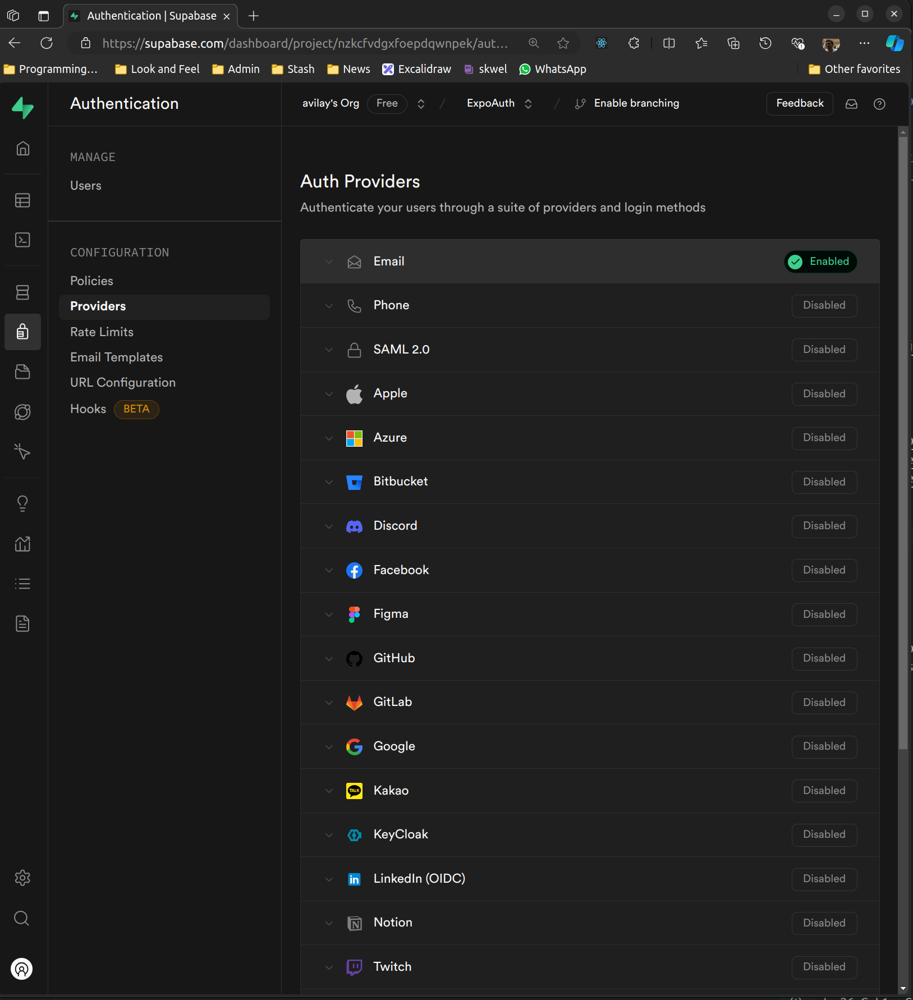
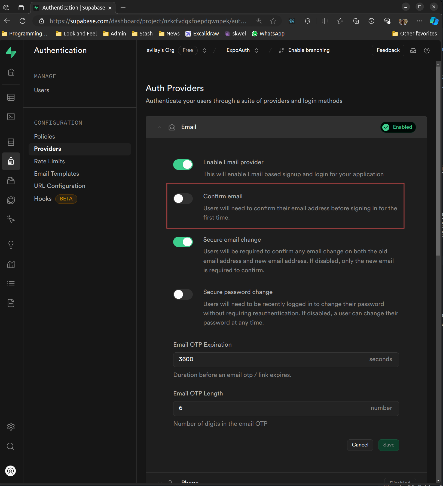
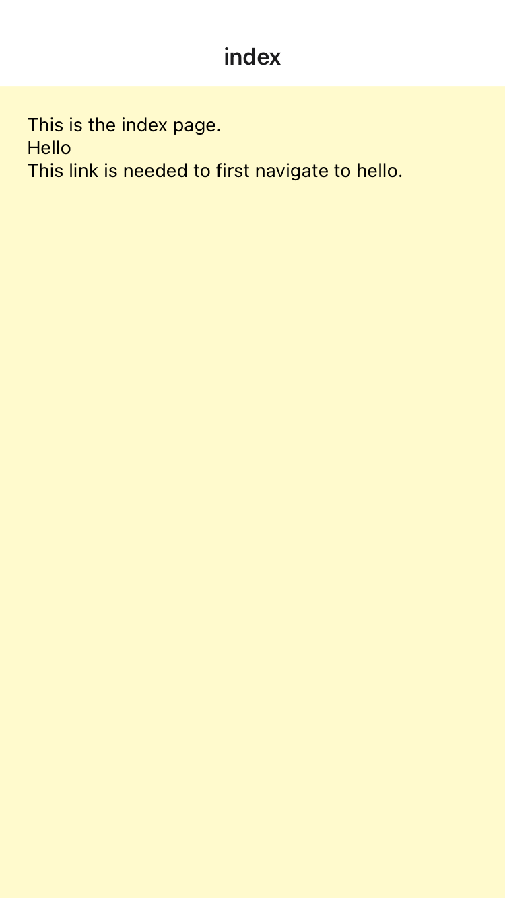
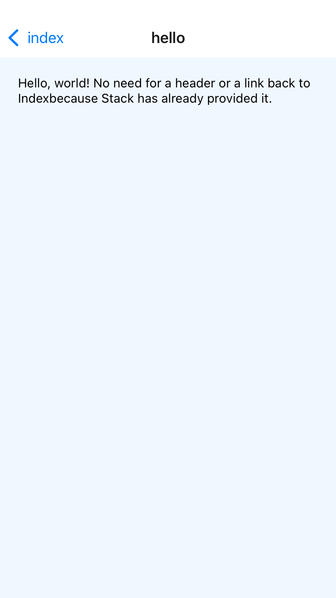

# Notes

## Refs

* https://docs.expo.dev/
* https://github.com/expo/expo/tree/main/templates
* https://github.com/expo/examples
* https://icons.expo.fyi/Index

## Initialize Project

```shell
npx create-expo-app ExpoAuth --template blank-typescript
```

This will create a blank project with no expo routes support. In most cases I'll want it. I can use -

```shell
npx create-expo-app@latest
```

This will give me a fully working app with 2 tabs and typescript support built in.

When a new blank project is created, the following packages are installed as dependencies by default:

- "expo": "~51.0.28",
- "expo-status-bar": "~1.12.1",
- "react": "18.2.0",
- "react-native": "0.74.5"

And the following are added as dev dependencies by default:

- @babel/core": "^7.20.0",
- "@types/react": "~18.2.45",
- "typescript": "^5.1.3"

## Setup Dev Environment

```shell
npm init @eslint/config@latest
npm install --save-dev --save-exact prettier
npm install --save-dev eslint-config-prettier
```

Write `.prettierrc`

```json
{
  "singleQuote": false,
  "trailingComma": "none"
}
```

When eslint is installed, it will create the config file `.esling.config.mjs`. I need to make two changes to it -

- Add `jsx-runtime` so eslint will not bug me to require/import React.
- Add prettier config which will disable all the eslint rules that conflict with prettier.
  The final config file should look like this -

```js
import globals from "globals";
import pluginJs from "@eslint/js";
import tseslint from "typescript-eslint";
import pluginReact from "eslint-plugin-react";
import eslintConfigPrettier from "eslint-config-prettier";

export default [
  { files: ["**/*.{js,mjs,cjs,ts,jsx,tsx}"] },
  {
    settings: { react: { version: "detect" } },
    languageOptions: { globals: globals.browser }
  },
  pluginJs.configs.recommended,
  ...tseslint.configs.recommended,
  pluginReact.configs.flat.recommended,
  pluginReact.configs.flat["jsx-runtime"],
  eslintConfigPrettier
];
```

## Start and Build

To start the dev frontend -

```shell
npx expo start
```


Remember to push to git and ensure that there is nothing in the staging area of git before doing the following -

To configure, build, and submit to app store

```shell
eas login
eas init
eas build:configure
eas device:create
```

This will generate an `eas.json` with different build environments. There is also a "submit" profile which specifies which build environment to use when submitting the build to app store. It is useful to first go to App Store Connect and create an App. This is because the app name needs to be unique across all of App Store. This way I can choose a name that will stick. Then copy the "Apple ID" of the app which is visible in the "General" > "App Information" tab. Paste this into the submit profile of eas.json as `ascAppId` like so -

```json
{
  ...
  "submit": {
    "production": {
      "ios": {
        "ascAppId": "6714371529"
      }
    }
  }
}
```

Now build the app -

```shell
eas build --platform ios
```

And then submit the app -

```shell
eas sumbmit --platform ios
```


## Supabase Setup

### Install Packages

```shell
cd ExpoAuth
npx expo install @react-native-async-storage/async-storage
npx expo install @supabase/supabase-js
npx expo install @rneui/themed
```

### Create Project



### Copy Details

Copy the project name and the anon key to [./lib/supabase.ts](./lib/supabase.ts) and the secret key to [.env](./env)





### Turn Off Email Verification





### Run App

#### Start the backend server

```shell
flask run -h 0.0.0.0
```

This will run the flask server on both localhost (127.0.0.1) as well as the LAN IP. Ensure that Show.tsx is using this local LAN IP.

#### Start the frontend app

```shell
npx expo start
```

This will start the app locally.

## Routes

To create a project just do `npx create-expo-app@latest` this will give an app that is already configured to routes. I can always move the existing code to an `examples` directory using a builtin script `npm run reset-project`. 

Another way is to use the routes example `npx create-expo-app -e with-router` but when I tried it, it insisted I `import React from react` even though I made the eslint config changes.

A third way is to create from a blank template as usual and then make some changes. This process is documented [here](https://docs.expo.dev/router/installation/#manual-installation)

### `app` Directory

An app with Expo router does not have the `App.tsx` as its entry point. Instead the entry point is in `./app/index.tsx`, there are bunch of other filenames that can be used by convention. Any other file that lives under the `app` directory automatically gets is own route. I can then nest more directories and they all get added to the url. I can even have parameterized routes if the page name is enclosed in square brackets `[user].tsx`. In the table below all physical directories are relative to the project root.

| Physical location          | URL Match                                                    |
| -------------------------- | ------------------------------------------------------------ |
| `./app/index.tsx`          | `/`                                                          |
| `./app/home.tsx`           | `/home`                                                      |
| `./app/[user].tsx`         | Matches dynamic paths - <br/> `/expo`, `/aptg` or anything else. |
| `./app/settings/index.tsx` | `/settings`                                                  |

 I can use the `Link` component from `expo-router` to link to different pages. This also works on the Expo test app. 

> See `routes-demo-3` for dynamic paths, see `routes-demo-1` for everything else.

### Layouts

Any directory starting with the `app` directory can have a file named `_layout.tsx` which can "decorate" the actually rendered views from other tsx files. To get a reference to the actual component being rendered, use the `Slot` component.

### Groups

If the directory name is enclosed in parens like `(help)` then it is "snipped" out of the route, e.g., `./app/(root)/home.tsx` matches `/home`. This can be used for some internal organization of pages.

> See `routes-demo-2`.

### Stack

This is the standard iOS style navigation. All I need to do is ensure that my `./app/_layout.tsx` is looking something like this -

```react
import { Stack } from "expo-router";

export default function RootLayout() {
  return (
    <Stack>
      <Stack.Screen name="index" />
    </Stack>
  );
}
```

Assuming I have two routes aka pages `./app/index.tsx` and `./app/hello.tsx` I should see -





Furthermore, I can stylize the stack header by passing `screenOptions` to the `Stack` in the layout, or I can set these options at an individual page level by using `navigation` object or setting `Stack.Screen` component in the individual page.

> See `routes-demo-3`

There is more in the docs about manually dismissing screens on the stack, but I doubt if I'll make complex enough apps to warrant that.

### Tabs

This is the standard bottom tab navigation pattern I see in iOS apps all the time. I need to create a group and put my pages in there. Then I need two layouts, the root layout sets up a barebones `Stack` with the group name. The group layout has the tabs settings. I don't need to use routes to link to different tabs. I use the `name` attribute of `Tabs.Screen` for this. My bare bones tab directory structure should look something like -

```shell
app
├── _layout.tsx
└── (tabs)
    ├── index.tsx
    ├── _layout.tsx
    └── settings.tsx
```

> See routes-demo-4

### Modal

For simple modals use React Native's Modal. But for Edit or Add type scenario, use Expo Router's Modal. I create a modal page and then link in the Stack as a StackScreen setting the presentation option as `modal`. There are whole bunch of other options I can set but none seem like anything I'd ever use. Now I can link to the modal just like any other page, and clicking on the link will load the modal (sliding up from the bottom for iOS).

> See `routes-demo-4`

### Stack Inside Tabs

> See `routes-demo-5`

