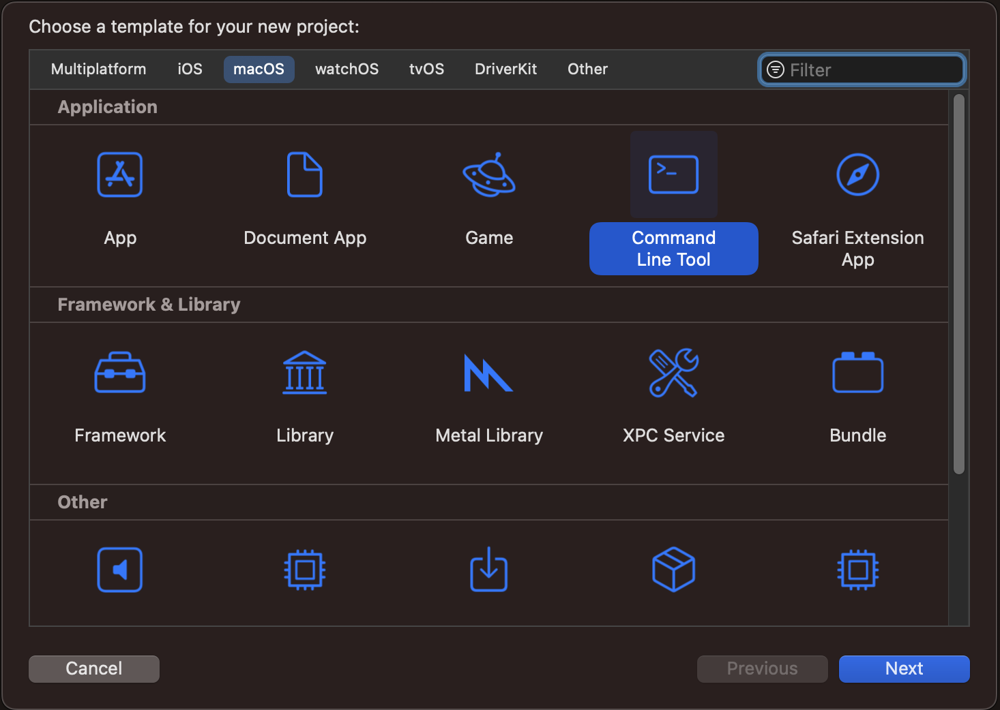
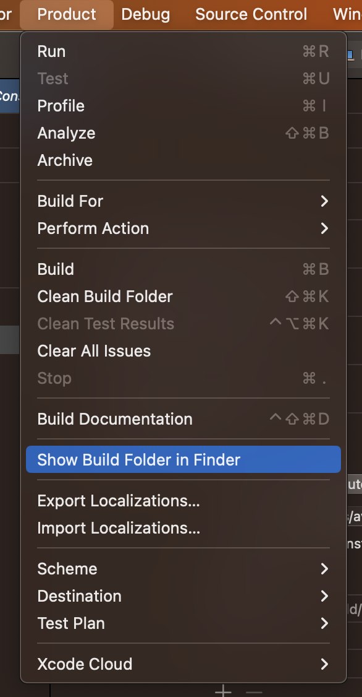

# Swift Notes

### Console App

Here is how to create a console app -

The binary is created in some sort of a temp dir which I can get like so -

As part of the build process, I can tell xcode to copy the built file to some directory of my choice in the build settings. See the full video of me creating and running a console app in [create_console_app.mp4](./create_console_app.mp4). 

### Adding 3rd Party Packages

When in a project go to `File > Add Packages ...` in the window either search for the package name or add the package URL directly. 

### String Formatting Numbers

