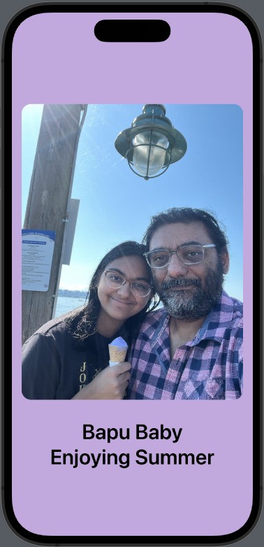
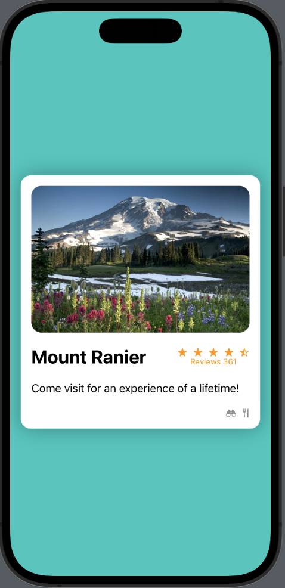
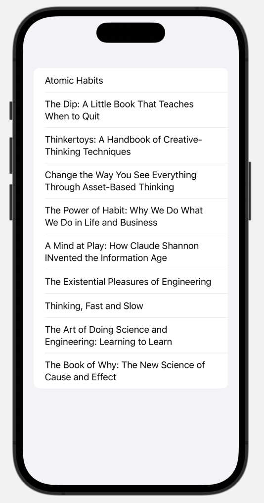
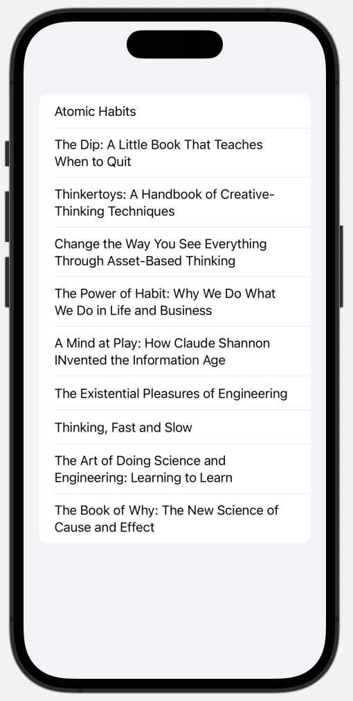
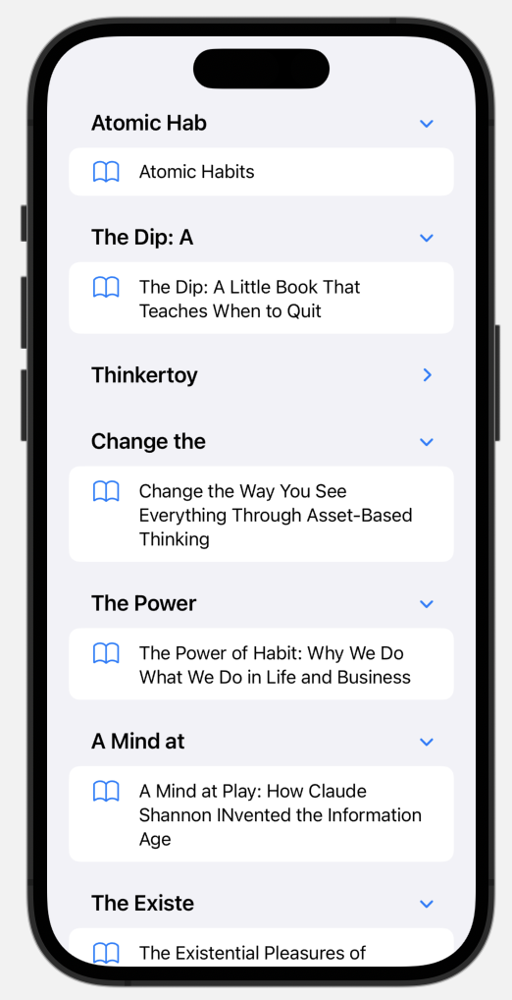
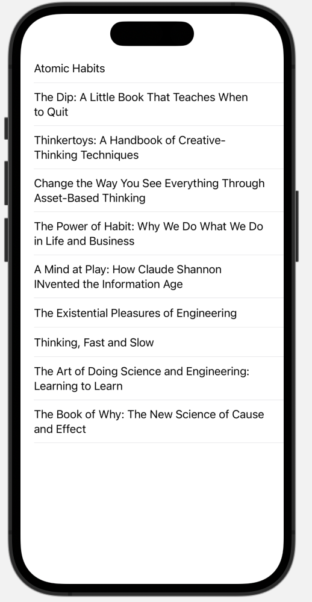
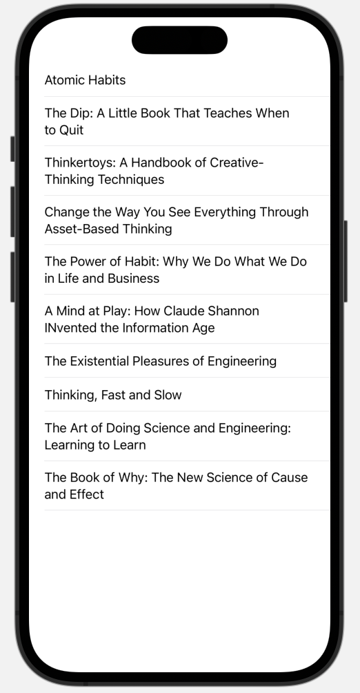
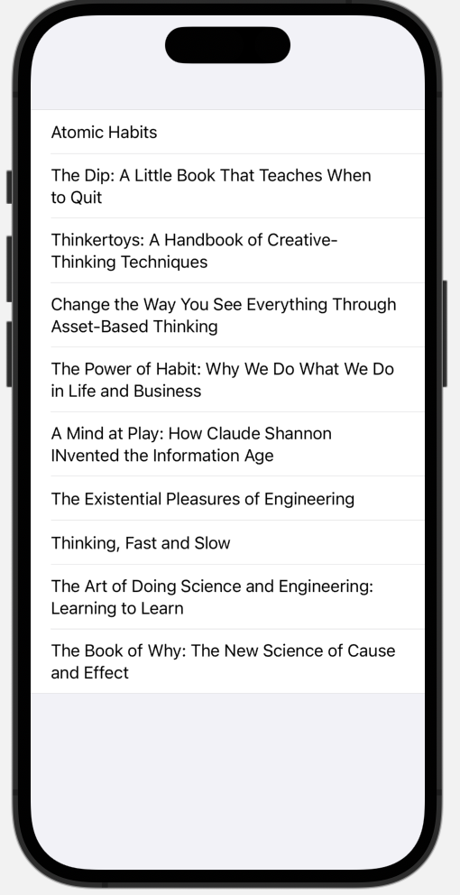

# SwiftUI Notes

#### TODO

* Add notes about `@MainActor` attribute.
* Add notes about `dismiss` environment value.


### Project Description

I have a number of projects titled `LearnIOS<n>`. This section describes what is in each project -

#### LearnIOS1

This app is a single static view that looks like -



#### LearnIOS2

This is another static view but it is a bit more stylized -



#### LearnIOS3

Demonstrates the use of `List` and `ForEach`. 

#### LearnIOS4

Demonstrates the use of `NavigationStack` and `NavigationLink`.

#### LearnIOS5

Demonstrates built-in button styles.

#### LearnState

Demonstrates the different attributes an instance variables in a View can have.

###### No attribute

When I want to use the value of the instance variable in the UI, but it is never changed in the UI, then I can use a plain old `var`, in fact I am probably better off using `let`. The only way this can be set is when the View is initialized for the first time. This is demonstrated in the `ToggleButton` custom component view.

###### `@State` attribute

The most pedestrian of attributes. It is used for instance variables that are going to be updated inside the View. The UI will immediately reflect this change. If the variable is a struct, then it is possible to change a property of the variable. If it is a class, while the actual property can be changed, the change will not be reflected in the UI. The only way to reflect the change is to replace with a new object. Every time the UI is reloaded, any changes made to the state the last time the view was in view, are lost.

#### Passing objects between views

==It is a bad smell if a `@State` in one view is passed as a `@State` to another view==, regardless whether the passed object is a class or a struct. If it is a struct, which is passed by value, its changes are not going to be reflected back to the "from" view. If it is a class, which is passed by ref, it will have its values changed, but the UI in the "from" view will not reflect those changes.

It is a bad smell if a bare class that does not implement the `ObservableObject` protocol is being passed around. 

###### `@Binding` attribute

When I want to pass a mutable `@State` to a child component view where the object can be mutated, and I want the changes to reflect in the parent view, I can pass in the `@State` var in the parent view as a `@Binding` var in the child view by prefixing the variable name with `$`. `@Binding` decorator in the child view tells the runtime that updates to this state need to be reflected back in the caller. Inside the child, this variable will pretty much behave as a state var. 

###### `ObservableObject`

Used when there are objects that live outside of the UI, e.g., data model objects, that need to be passed around. These should be implemented as classes implementing the `ObservableObject` protocol by decorating some instance properties as `@Published`. When a view holds a reference to such an object and one or more of the `@Published` properties change somewhere in a descendant view, the change will be reflected here.

###### `@StateObject` and `@ObservedObject`

An instance of an `ObservableObject` has to be decorated with either `@StateObject` or `@ObservedObject`. Based on what I have read, I should use `@StateObject` in the View that will manage the lifecycle of the object, typically the topmost view that will need this. Any other view should use `@ObservedObject` decorator. I read somewhere that `@ObservedObject` will be reinstantiated everytime the view is regenerated, but `@StateObject`s are not, but I don't see that in my experiments.

###### `@EnvironmentObject` 

This behaves exactly like `@ObservedObject`, except I don't have to explicitly pass it in the constructor of the receiving View. I have to pass it in using the `environmentObject()` method and then the object will be available to any descendant view of the receiving view. All any view that wants to use this object has to do is to declare the instance variable with this attribute.

### learn-group

See Refresion Pages section in SwiftUI Recipes note.

### HStack and VStack

Two most commonly used layout containers are `HStack` and `VStack`. I can set the alignment of all the elements inside the container using the `alignment` ctor arg. In case of `HStack` it will be `.top`, `.bottom`, etc. and in case of `VStack` it will be `.leading` for left aligned (in Left To Right displays), `.trailing` or right aligned and so on. By default all the contained elements are packed tightly together. I can set the spacing between them using the `.spacing` ctor arg.

```swift
HStack(alignment: .top, spacing: 30) {
  ...
}
```

While I can use a combination of `spacing:` ctor arg and `.padding()` modifier, a much scalable way to space out elements is using the `Spacer` view. The way spacers are work are, the system first calculates the absolute maximum size possible for this container. It then subtracts the size of existing elements. The resulting difference is the available empty space. It then divides this available empty equally between all spacers.

```swift
VStack {
  Text("Hello")
  Spacer()
  Text("World")
}
```

### Group

If I want to group multiple views components together without effecting their layout, I can use group. Unlike `VStack` and `HStack`, `Group` will not change anything about the layout of its child components. 

### background


I can give any view, whether it is a container or any other view, a background. A background can take in a shape or a closure that returns a `View`. Here is how I used it to create a "card" -

```swift
VStack {
  ...
}.background(Rectangle().foregroundColor(.blue).cornerRadius(15).shadow(radius: 15))
```


### Font

Some common modifiers that seem to work for any View, including container views are -

* `foregroundColor` to set the font color if the container has any text-like, or sets the fill color of the container.
* `font()` to set the font size.
* `fontWeight()` to set the font emphasis.
* `padding()` adds some padding space inside the boundary of the view.


### Font Icons

There is an Apple MacOS app called "SF Symbols" that has the names of all Apple's font icons. The way to use it is to use the `systemName` arg in `Image` view -

```swift
Image(systemName: "pencil")
```

To change the font size of these icons, use the `scaleEffect()` modifier, e.g., to double the size do this -

```swift
Image(systemName: "pencil").scaleEffect(2)
```


### ZStack

To have a bunch of UI elements on top of a colored background -

```swift
ZStack {
  Color(.blue).ignoreSafeArea()
  VStack {
    ...
  }
}
```

`.ignoreSafeArea` expands the view (in this case `Color`) all the way up and down the phone.


### Image

To use the `Image` view element -

```swift
Image("asset_name").resizable().aspectRatio(contentMode: .fit).cornerRadius(15.0)
```

Here `asset_name` is the exact name of the image in the Assets folder. Another useful modifier is `scaleEffect` to change the overall size of the image.

 ==TODO==: How do I display a dynamically downloaded/generated image?


### Text

To use the `Text` view element -

```swift
Text("Bapu Baby Enjoying Summer").font(.largeTitle).fontWeight(.semibold)
```

Font size is specified using the `.font()` modifier and emphasis is specified using the `.fontWeight()` modifier.


### Button

There are a bunch of interesting `Button` ctors,  the most common one is -

```swift
init<S>(_ title: S, action: @escaping () -> Void) where S : StringProtocol
```

Here is how I'd use it -

```swift
Button("Click Me!") {
  // onclick event processing in this closure
}
```

Another useful one is -

```swift
struct Button<Label> where Label : View
init(action: @escaling () -> Void, label: () -> Label)
```

A thing to note is that `Label` is just the template name of the type, it does not mean the `Label` element. The `Label` here must be a `View`. Here is how to use this ctor to display a button with an image button -

```swift
Button {
  // onclick event processing in this closure
} label {
  Image("button-asset-name")
}
```

Note the weird closure syntax above where for some reason I can get away without specifying `action:` in the first arg and not have to put the `:` after `label`. 

To change the color of the button use the `.tint` method.

### @State

To use an editable property inside a view, decorate the property with `@State` -

```swift
struct ContentView: View {
  @State var score = 0
  
  var body: some View {
    Text(score)
    Button("Click Me!") {
      score += 1
    }
  }
}
```

This property is being used by a UI element, which makes it immutable. In order to make it mutable, I need to decorate it with the `@State` decorater so that I can mutate it inside the button's on-click event handler.


### Binding

I can call a View component from another View component. The child component usually processes and displays some data passed in by the parent component, in most cases mutating it in some way that needs to be reflected back in the parent's copy of this data. In the parent this is probably just a plain old `@State` property. When instantiating the child view, I need to pass this property in using the `$` prefix. I need to declare a property using the `@Binding` keyword.

```swift
struct Parent: View {
  @State var prop: Int
  
  var body: some View {
    // Use prop in some way
    Child(inheritedProp: $prop)
  }
}

struct Child: View {
  @Binding inheritedProp: Int
  
  var body: some View {
    // Some UI that may change the inheritedProp    
  }
}
```

In case I want to just pass a constant value to the bound property, I need to use `Binding.constant(42)`, I cannot just pass in the value 42 directly. This is mostly useful in the preview provider code.

### List

Another common container is the `List` container that will display all the contained views in a single list. `List` has a bunch of nice looking formatting including being scrollable. 

```swift
struct List<SelectionValue, Content> where SelectionValue : Hashable, Content : View
```

The two common ctors that I have used so far are -

```swift
init<Data, RowContent>(
    _ data: Data,
    rowContent: @escaping (Data.Element) -> RowContent
) where Content == ForEach<Data, Data.Element.ID, RowContent>, Data : RandomAccessCollection, RowContent : View, Data.Element : Identifiable
```

`Data` can be any `RandomAccessCollection` type which includes arrays. However, each element of this collection must implement the `Identifiable` protocol, which means that they need to have a property called `id` that must uniquely identify the element. Here is what its usage looks like -

```swift
struct Item: Identifiable {
  id: UUID = UUID()
  name: String
  price: Float
}

struct ContentView: View {
  @State var items: [Item] = [
    Item(name: "Item One", price: 1.11),
    Item(name: "Item Two", price: 2.22)
  ]
  
  var body: some View {
    List(items) { item in
      // Display this item as a row in this list
    }
  }
}
```

The second ctor makes it possible to bypass the `Identifiable` protocol requirement - kind of.

```swift
init<Data, ID, RowContent>(
    _ data: Binding<Data>,
    id: KeyPath<Data.Element, ID>,
    rowContent: @escaping (Binding<Data.Element>) -> RowContent) where Content == ForEach<LazyMapSequence<Data.Indices, (Data.Index, ID
)>, ID, RowContent>, Data : MutableCollection, Data : RandomAccessCollection, ID : Hashable, RowContent : View, Data.Index : Hashable
```

Here there are no restrictions on `Data.Element`. However, there is an additional input param called `id` where I can specify the "path" of some sub-portion of the data element that can serve as its id. Mostly I want to use the data element itself as id, there is a weird syntax for that -

```swift
struct ContentView: View {
  var items = ["Item One", "Item Two"]
  
  var body: some View {
    List(books, id: \.self) {book in
			// Display this item
    }
  }
}
```

##### List Styles

There are three main styles avaialble on iOS - `.automatic`, `.plain`. and `.grouped`.

`.automatic`




`.insetGrouped` looks exactly like `.automatic`.




`.sidebar` works when I am using Section to give a heading to each item. Sidebar gives a small down arrow to minimize the list item.




`.plain` gets rid of the outer container



`.inset` looks like `.plain`




`.grouped` is somewhere in between `.automatic` and `.plain`.




### onAppear

A common idiom is to load the list data when the list view appears on screen. I can use the `onAppear` modifier for that. This can be used on any View.

```swift
List(items) {item in 
	Text(item.description)            
}.onAppear {
  items = dataService.fetch()
}
```


### onTapGesture

This is a tap handler modifier that I can call on any View element. I can provide a closure that will do something when the UI element in question is tapped.

```swift
Image("image-asset-name").onTapGesture {
  print("Image tapped")
}
```


### ForEach

Whereas `List` is a container and an iterable (in Python lingo), `ForEach` is just an iterable. I have to wrap it inside some sort of layout container to see the results. The two ctors are very similar to `List` where I can either have each element in the collection implement the `Identifiable` protocol, or use the `id` param with the weird syntax.

```swift
struct ContentView: View {
  var items = ["Item One", "Item Two"]
  
  var body: some View {
    VStack {
      ForEach(books, id: \.self) {
        Text(book)
      }
    }
  }
}
```


### TabView

The menu at the bottom of the most phone apps is called the `TabView`. The general pattern is pretty simple, I create a main view with only the `TabView` which loads different views for each tab. Here is the syntax for this -

```swift
TabView {
  NewView().tabItem {
    Label("New", systemImage: "doc.fill.badge.plus")
  }
  EditView().tabItem {
    Label("Edit", systemImage: "square.and.pencil")
  }
}
```

The ctor I am using here accepts a closure that returns a View. However, I haven't figured out how declaring two views inside the closure works for this. Both `NewView` and `EditView` are two other custom views that I need to have defined. The view returned by the `.tabItem` modifier is what is displayed in the menubar below.


### ScrollView

Just like the `List` container view, I can make any view I want scrollable when there is more content than will fit in the screen.

```swift
ScrollView {
  VStack {
    ...
  }
}
```


### LazyVGrid

When I want to show items in a grid. The the number of rows in the grid is calculated at runtime (explains the "lazy"?), but I have to specify the number of cols at compile time.

```swift
LazyVGrid(columns: [GridItem(), GridItem(), GridItem()]) {
  ForEach(items) {item in
		// Display the item
	}
}
```

I can customize the gutter width between columns by passing a `spacing` argument to the `GridItem()` ctor, and the gutter width between rows by passing a `spacing` argument to `LazyVGrid` ctor.


### GeometryReader

A lot of times I'll need to set up spaces or widget size at runtime depending on the screen size. For this I can use the `GeometryReader`. The closure is given an `GeometryProxy` object from which I can read a bunch of properties including the size of the size. I can then calculate the spacing based on this size.


### Modals or Sheets

A modal UI element is called a "sheet" in iOS. I can display a modal on any container element using the `.sheet()` modifier. 

```swift
struct ContentView: View {
  @State isPresented = false
  
  var body: some View {
    VStack {
      ...
    }.sheet(isPresented: $isVisible) {
			ModalView()
    }
  }
}
```

`ModalView` is just your plain old view struct that will be shown inside the popup modal (aka sheet). Notice, that the `isPresented` arg is a binding. The sheet is presented whenever this state property is set to true. Some user action on some element inside the `VStack` is expected to turn it on and the modal will pop up.

Here is a full end-to-end pattern that I have seen -

```swift
struct ContentView: Veiw {
  @State isVisible = false
  
  var body: some View {
    VStack {
      Image("image-asset-name").onTapGesture {isVisible = true}
    }.sheet(isPresented: $isVisible) {
      ModalView()
    }
  }
}
```


### NavigationStack

To get a page drilldown like UI, e.g., product list > product detail + reviews > review detail > etc. The main view needs to be wrapped in the `NavigationStack` component. Inside it I can have any container stack (except lazy containers) like `List`, `VStack`, etc. Inside this container I'll typically have a number of `NavigationLink` components. For each one of these I need to provide the tappable/clickable text that will be displayed as well as the destination View to go to when clicked.

```swift
struct MainView: View {
  var items: [ItemOne] = ...
  
  var body: some View {
    NavigationStack {
      List(items) { item in
      	NavigationLink {
          ItemOneView(item: item)
        } label: {
          Text(item.name)
        }
			}
    }
  }
}
```

For multi-level navigation, I don't have to wrap the second level view in a `NavigationStack` again, I just need to follow the same pattern of displaying a bunch of `NavigationLink`s. A clever way to make previewing the second level is to wrap the preview call inside a `NavigationStack`.

```swift
struct ItemOneView: View {
  var item: ItemOne
  
  var body: some View {
    VStack {
      Text(item.title)
      ForEach(item.items) { item in 
      	NavigationLink {
          ItemTwoView(item: item)
        } label: {
          Text(item.title)
        }
      }
    }
  }
}

struct ItemOneView_Previews: PreviewProvider {
  static var previews: some View {
    NavigationStack {
      ItemOneView(item: dummyItemFromSomewhere)
    }
  }
}
```

By default the nav bar at the top will simply read "< Back". In order to customize this, I can use the `.navigationTitle()` modifier on the view wrapped by `NavigationStack`. It will do two things, it will show up as the title of the view, and when the user drills downs, the top nav bar will have the view that the user just came from.


### Reading package/bundle contents

Whenever I create a file, I have the option of making it a part of the Target project (usually indicated by a checkbox). This means that the file in question will be included in the final build package, aka bundle as it is called in the iOS world. The programmatic way to get the location of contents in the bundle is to use the `Bundle` object -

```swift
let url = Bundle.main.url(forResource: "data", withExtension: "json")
```

This will give me the path of "data.json" file.	

### View Initialization

I haven't completely figured out how this works, but here is what I have learnt so far - if I have a `@State` variable, then there is no good way to initialize it in the View's `init` method, the only thing I could do is declare it as optional and set it to `nil` inside `init`. I had a `DateFormatter` as an instance variable that I had initialized upon declaration, but there was no way I could set its properities inside the `body` method. I got `Type '()' cannot conform to 'View'` error.

### Formatting Numbers

```
Text("$\(videoGame.price, specifier: "%.2f")")
```

