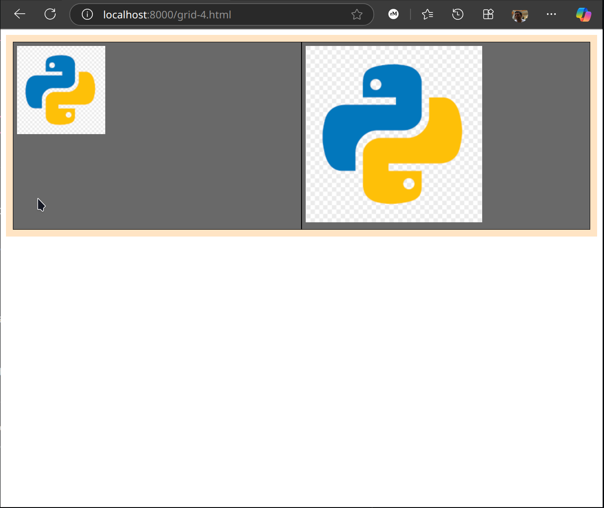
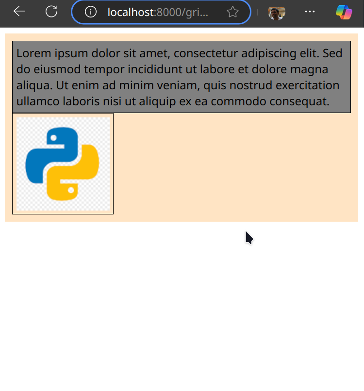
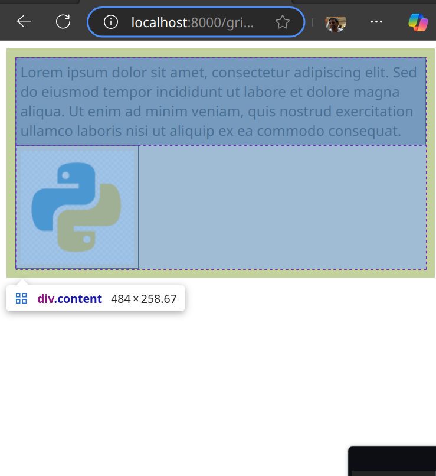
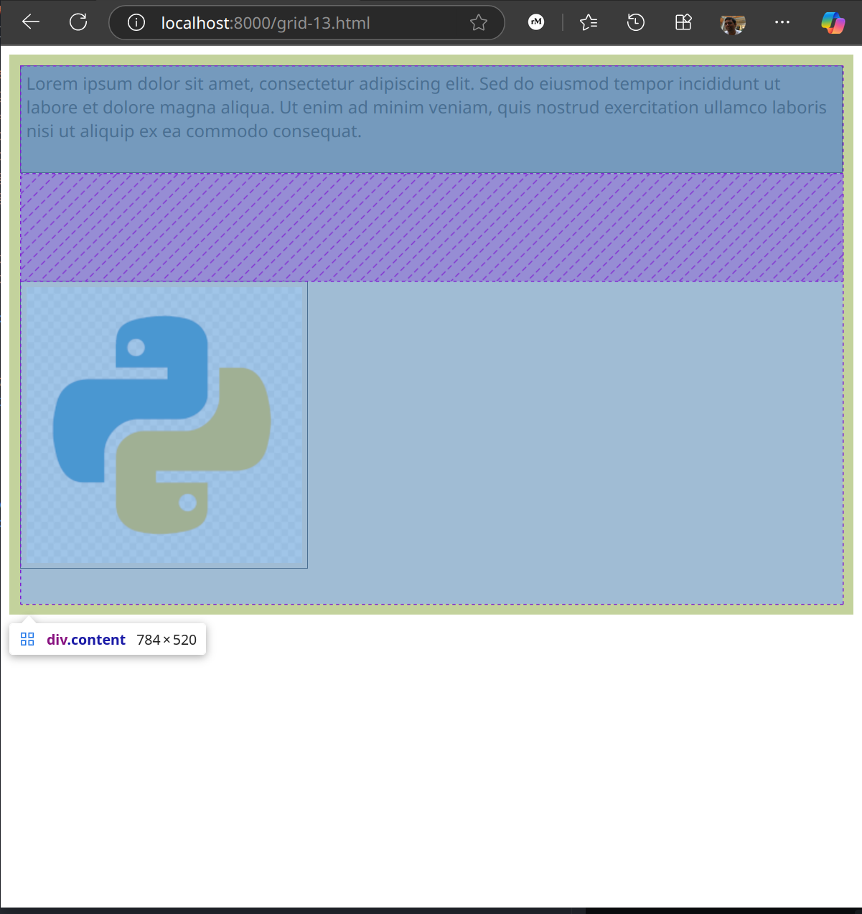

# Layouts

I can think of a web page design as laying out boxes within boxes and beside other boxes and under/over some more boxes and so forth. This is by far the most confusing part of web ui design for me! There are three different types of layouts - 

* flow: This is an old layout where headings and paragraphs stack vertically on top of each other and text and images sit within.
* flex: This is for controlling the alignment of rows/columns.
* grid: This is for controlling the overall rows and columns.

## Grid

*Refs:*

* https://www.joshwcomeau.com/css/interactive-guide-to-grid/
* https://developer.mozilla.org/en-US/docs/Web/CSS/CSS_grid_layout

Set the `display` attribute to `grid` to opt-in to this layout -

```css
.content {
  display: grid;
}
```

```html
<div class="content">
  <div class="item">...</div>
  <div class="item">...</div>
  <div class="item">...</div>
</div>
```

### Debugging

 When I have the DevTools open, I can see the window size of my browser as I resize it. This is useful when testing the responsiveness to different viewport sizes.

I can change the settings of the DevTools to show grid lines when I hover on the content. I did not know about it when I started writing these notes otherwise I would not have added my own background color, padding, and borders.


### Single-Column Multi-Row Default

By default this creates a single-column multi-row grid. Each child element of the grid (in this case the `item`s) will get their own row. As I keep adding child items, the number of rows will increase. Additionally, just like any other web style/element, the height of the grid (in this case the `content` div) is determined by its childrens' content size and viewport width. The above html will produce something like this (see [grid-1.html](./grid-1.html) for full code) -


> I have added some padding to the grid to easily differentiate the parent grid from its children.

### Controlling the Height

If I explicitly set the height of the grid, then it will be distributed between the rows. 

```css
.content {
  display: grid;
  height: 700px;
}
```

The total row heights will not necessarily be equal. The additional available whitespace is however, equally divided. See [grid-2.html](./grid-2.html) for full code. As I change the viewport width, I'll see the content inside the grid change its height as expected, but the grid itself will always be 700px tall.


### Multi-Column Multi-Row

If I want to have multi-column layout I can add that to the style -

```css
.content {
  display: grid;
  grid-template-columns: 75% 25%
}
```

This will take the first two children and put them on the same row. The total width of the row is the viewport's width. 75% of this width is given to the first column, and 25% to the second column. It will then take the next two children and put them on the next row and so on. The last row is partially filled in case of overflow. Each row's height will depend on the size of the largest content in that row, e.g., in the screenshot below the second row is taller than the first because it has to accommodate more content in the same width constraints. See [grid-3.html](./grid-3.html) for code.


The problem with specifying column width in terms of %age is that regardless of the content size, the column will **always** be 75% and 25% of the viewport/row, even if the content gets cropped out. Consider this setup where I have a 256x256 image as the second child. I have specified the column widths to be `50% 50%`. As long as the image is fitting in the allotted space everything is fine -


As I narrow the viewport, the row height will dynamically adjust. However, if I narrow the viewport beyond 256x2 px, the image will no longer fit in its allotted width and will get cropped off.


This can be solved with using the `fr` (fractional) units instead of %ages. The end result is that it will try to maintain what I have specified, but beyond a certain point it will seem to do the "smart" thing where it scrunches the content that can be scrunched and keeps other content as-is, even though it is not looking like what I specified. E.g., with this I am saying is use 1 unit of space for the first column and second unit of space for the other column -

```css
.content {
  display: grid;
  grid-template-columns: 1fr 1fr;
}
```

When there is enough space the columns look of equal width, but with narrower viewports this is what happens - 


According to [this blog post](https://www.joshwcomeau.com/css/interactive-guide-to-grid/) this is because `fr` distributes the **extra** whitespace and not the total whitespace. However, this is not what I see, e.g., when I replace the first item with another image but of a different size (128x128) I see this -



It is clear that the white space was not distributed evenly, the total space was.

See [grid-4.html](./grid-4.html) for code.

### Gutters

Use the `gap` attribute to set a gutter between all rows and all columns. Here is the text-only example with a gap of 5px. 

```css
.content {
  display: grid;
  grid-template-columns: 50% 50%;
  gap: 5px;
}
```


This usually works well when the column widths are in `fr` instead of %ages, probably because the %ages are calculated before the gap is counted and fractions are calculated after the gap. See for example what happens when the gap is 30px, the content in the red rectangle on the top right has bled off the container. If I change the column widths to `fr`, this does not happen.


See [grid-5.html](./grid-5.html) for code.

### Controlling Rows

As seen above, the number of rows is determined dynamically depending on the number of children and columns. I can also explicitly control the number and height of each row. If the number of children is not equal to the row count x col count, then a new row will be created for the overflow children just like before.  This leads me to believe that this is mainly useful to control the row height and not so much the row count. 

Here is what the ui looks like without any row specification -


Here is what it looks like with 

```css
.content {
  ...
  grid-template-rows: 15rem 1fr;
}
```


See how the first row is taller than the content needs. If I had given both rows 1fr, i.e., -

```css
.content {
  ...
  grid-template-rows: 1fr 1fr;
}
```


Here both the rows are of the same height as the image, even though none of the content needs that much height. If I narrow the viewport the rows will get taller -


Keeping the width constant to the viewport width, the "natural" heights of all content is calculated, the tallest is taken as the unit and everything else calculated based on that. See [grid-6.html](./grid-6.html) for code.

Specifying row heights in terms of percentages works similar to columns, i.e., the total height will first be calculated based on the contents' natural heights, then the total height will be divided into the percentages specified without taking the contents' natural height into consideration. The content will then be force-fit into their allotted space.


Here I have an image of height 512px along with text (fully elastic) content with the row heights specified as 50% 50%. The text content's height was calculated based on the viewport width, the image's height is constant, both were added up to get the total height. It was divided 50/50 and the content placed with little regard as to whether the content actually fits. See [grid-11.html](./grid-11.html).

### Using the `repeat` keyword

Lets say I want to have 20 columns each with a width of 1fr. The css will look like -

```css
.content {
  grid-template-columns: 1fr 1fr 1fr .... <repeated 20 times>;
}
```

Obviously this is not ideal, CSS has some syntactic sugar to make this easy -

```css
.content {
  grid-template-columns: repeat(20, 1fr);
}
```

### Controlling Conent Placement

So far we have seen that each child will be automatically be placed on the first available cell. I can control this placement.

```css
.content {
  display: grid;
  grid-template-columns: repeat(4, 1fr);
  grid-template-rows: repeat(4, 1fr);
}

#item1 {
  grid-row: 1;
  grid-column: 3;
}

#item2 {
  grid-row: 1;
  grid-column: 1;
}

#item3 {
  grid-row: 4;
  grid-column: 2/5;
}
```

Here is what this translates to -


When specifying a specific row/col I need to use the (1-based) index number of the row like in `#item1` and `#item2`, but when specfying a span I need to use the "tick" marks for the start and end of the span like in `#item3`. Here is what it looks like -


Negative tick marks also work, but too lazy right now to demo that. See [grid-7.html](./grid-7.html) for code.

### Grid Areas

Let say I want the following layout -


I can always declare this using the cell spans along with controlling the number of rows and columns. However, there is an easier, more declarative way of getting this done -

```css
.content {
  display: grid;
  grid-template-columns: 2fr 5fr;
  grid-template-rows: 75px 1fr;
  grid-template-areas:
    'sidebar header'
    'sidebar main';
}

header {
  grid-area: header;
}

#sidebar {
  grid-area: sidebar;
}

main {
  grid-area: main;
}
```

In line 6, I kind of sketch out the layout using ASCII art. I am calling the template sections `sidebar`, `header`, and `main`, but I can call them anything. Here is what it actually results in -


See code in [grid-8.html](./grid-8.html).

### Alignment

I can control both how my grid is positioned in the empty space as well as how my content is placed within the grid cells. 

#### Content Alignment

I can align the content inside the cell in both the x- and/or y-directions. To move it horizontally (i.e., x-direction) I need to use `justify-items`, to move it vertically (i.e., y-direction) I need to use `align-items`.

##### Horizontal Content Alignment

Lets look at horizontal alignment first. The default is that content will keep its actual size and will be start- (or left-) aligned. Here I have a 126x126 image in a 500x500 window. This is the same as setting an additional style attribute `justify-items` to "start".

```css
.content {
  display: grid;
  justify-items: start;  /* this is the default */
}
```



⚠️ An important thing to know is that cell size and its placement within the grid has not changed. It is only the content within that is changing. The black border is around the content, not the cell! This is evident when I turn on the grid debug settings in DevTools and hover over the `.content`. The dotted line shows the grid. 

> 🤔 One thing that still puzzles me is why is the padding outside the grid? Margins are outside the selector, but aren't paddings supposed to be inside?



Now, if I set the `justify-items: end` then I see this -


Of course this will only work if the content size is smaller than the cell size. Otherwise the content will either fill or overflow the cell.

Center gives me this -


And, if I set it to "stretch" then I see this -


The actual image is square at 126x126, but because the viewport is wider than that, the image resizes horizontally to fill the entire viewport, but the browser will still try to maintain the aspect ratio and will make the height equal to the width even though it means that the actual grid will now overflow out of the viewport. 

I can try this with multiple columns as well. Here is when the content is end- (aka right-) aligned with column widths set to 2fr and 1fr.

```css
.content {
  display: grid;
  grid-template-columns: 2fr 1fr;
  justify-items: end;
}
```


Check this out with the code in [grid-9.html](./grid-9.html).

While not evident in these examples, content in both the cells is being aligned, not just the image. However, if I want to only align a single cell I can use `.justify-self: start | end | stretch | center`. 

##### Vertical Content Alignment

By default the row height dynamically adjusts itself to the content height, so there is no need (or literally space) for vertical alignment. Only when I specify the row height does this come into play. Use `align-items: start | end | stretch | center` for this.

Here is what it looks like when I have the following gird settings -

```css
.content {
  display: grid;
  grid-template-rows: 1fr 1fr;
  align-items: end;
}
```


Just to drive home the difference between fr and %, here is what it looks like when I set the row heights to be `50% 50%` -


See the code in [grid-12.html](./grid-12.html).

Just like with horizontal alignment, I can also vertically align individual cells using `align-self`.

#### Grid Alignment

##### Horizontal Grid Alignment

The grid width is determiend by the viewport width, and when I specify the column width in terms of franctions or percentages, all the columns will be stacked one beside the other without any space left for any alignment. However, if I specify the column width in exact pixel sizes, then there is a possibility that I'll need to align the columns. I need to use `justify-content: start | center | end | space-between | space-around | space-evenly` for this.

Here I have set the grid as under -

```css
.content {
  display: grid;
  grid-template-columns: 300px 200px;
  justify-content: space-between;
  justify-items: end;
}
```


The purple space in between the columns is created because of `justify-content: space-between`, whereas `justify-items: end` is pushing the image to the right. See [grid-10.html](./grid-10.html) for this.

##### Vertical Grid Alignment

The grid height is dynamically calculated, so when I specify the row heights in fractions or percentages, the rows are stacked one below the other with no space for vertical alignment. Even when I specify the row size in exact pixels, the grid height will dynamically expand and the rows will still be stacked one below the other with no space for alignment.

The only time vertical grid alignment will come into play is when I have explicitly set the height of the grid in exact pixels, **and** I am specifying the row heights also in exact pixels. If I am setting the row height in fractions or percentages, again the rows will just expand to fill the entire height with no room for alignment. I can set this using `align-content: start | end | center | space-between | space-around | space-evenly`

Here is what it looks like when I have the following grid setup -

```css
.content {
  grid: display;
  grid-template-rows: 100px 300px;
  height: 500px;
  align-content: space-between;
}
```



### Grid Running Notes from Coursera

Setting the column width to `auto` makes it responsive -

```css
.container {
  display: grid;
  grid-template-columns: 100px auto;
  grid-template-rows: 50px 50px 50px;
  gap: 3px;
}
```

See `grid-coursera-1.html` for nice example with good styling and stuff. But  this is not the best way to make grids responsive. Use `fr` units instead.

A shorthand way for setting the `grid-template-columns` and `grid-template-rows` is to say `grid-template: <rows> / <cols>`.

```css
.container {
  display: grid;
  grid-template: repeat(2, 50px) / repeat(3, 1fr);
  grid-gap: 3px;
}
```

What the following does is the number of columns is set to be automatic depending on the viewport width. Each column width should be at a minimum 100px, but if the viewport width is not a multiple of 100, then all the columns should take up equal space. The number of rows is also automatically set with each row being 100px in height.

```css
.container {
  display: grid;
  grid-gap: 5px;
  grid-template-columns: repeat(auto-fit, minmax(100px, 1fr));
  grid-auto-rows: 100px;
}
```

Along with `auto-fit` there is also a value called `auto-fill` that does something similar, but instead of stretching the columns to fit in the space, it will just create empty columns.

The course has a pretty good example of creating an image grid of differently sized images, but I am unable to download the course content. Here is the CSS -

```css
.container {
  display: grid;
  grid-gap: 5px;
  grid-template-columns: repeat(auto-fit, minmax(100px, 1fr));
  grid-auto-rows: 75px;
  grid-auto-flow: dense;
}

.landscape {
  grid-column: span 2;
}

.portrait {
  grid-row: span 2;
}

.big {
  grid-column: span 2;
  grid-row: span 2;
}
```

The `grid-auto-flow` property determines the grid-filling algo that the browser uses. By default it will fill the grid row-by-row. Because of the unequal sizes, it is possible that thare are gaps in the grid. By setting the flow to `dense`, the browser will use a grid-packing algo, where if there is gap and later on it comes across an item that can fit in the gap, it will go ahead and place the item there. Thus items are placed regardless of the how they appear in the HTML source. All landscape mode photos will span 2 cols and all portrait mode photos will span 2 rows. There are a couple of photos that I want to be twice as big as most other photos, so they will span both 2 rows and 2 cols. 

`justify-content` aligns items along the row axis and the `align-content` aligns the items along the column axis. `*-items` aligns items within the cell. `justify-items` will align the contents inside a cell along the row and `align-items` will align them along the column. I can also control the justification inside a specific cell by using `justify-self` and `align-self`.

## Flex

*Refs:*

* https://www.joshwcomeau.com/css/interactive-guide-to-flexbox/
* https://developer.mozilla.org/en-US/docs/Web/CSS/CSS_flexible_box_layout

What can flex do that grid cannot (or is harder to use)? So far I have come up with one concrete answer - Grid can dynamically control the dimensions of the rows/cols, but their counts remain fixed, Flex can can change the counts as well.


### Debugging

TODO

### Direction

Flex has a notion of a primary direction which can either be horizontal or vertical. Everything in flex is to control placement of content along this direction. This may be the reason it is called a 1-dimensional system vs. grid which is called a 2-dimensional system. The other direction is referred to as cross-axis. Horizontal direction is the default. This is what I'll stick to in this note, but know that everything here also works with the vertical primary axis.

I can specify any HTML element as a flexbox container by setting the `display: flex` property on it. By default all the items within this container are stacked one after the other in the primary direction. The items will stretch in the cross-direction to cover the entire height.

```css
.content {
  display: flex;
}
```

```html
<div class="content">
  <div>...</div>
  <div>...</div>
  <div>...</div>
</div>
```

TODO: screenshot with text.

It is not entirely clear to me why the widths of the first and the last text divs were chosen the way they were, but once the width was chosen the heights were calculated and the tallest item determines the height of the entire container. The rest of the items stretch. As I narrow the viewport the items will shrink but they will all still be stacked one after the other.

When items have a natural width like images, text boxes, buttons, etc. it is much clearer what is happening.

TODO: Screenshot with form.

Most content has a natural min-width below which the content won't shrink. For text it is the length of the longest word, for text boxes it is browser dependent. If I narrow the viewport, the content will shrink (see how the labels and text boxes are on separate lines now) but not beyond a certain point. After the items reach their min width, the content simply overflows the container. Lets add an image to the mix to see this more clearly. The content has overflowed to the right, when I scroll right I can see the red section that is outside of  the container.

TODO: Screenshot.

### Alignment

#### Primary Axis Alignment

Alignment only comes into play if there is space along the primary axis. I can set the alignment using `justify-content: flex-start | center | flex-end | space-between | space-around | space-evenly`. Here is what happens when I set the alignment to be "space-between".

TODO: Screenshot with form and space between.

It has no effect with the text because regardless of how much I widen the viewport, the items will expand to fill all the space, so there will never be any extra space remaining for alignment.

#### Cross Axis Alignment

I can set the alignment of all the items at once using `align-items: flex-start | center | flex-end | stretch | baseline`. This is what happens when I center align all my items.

TODO: Screenshot with text and alignment center.

In the form example there was no extra vertical space so cross axis alignment will have no effect.

### Growing and Shrinking

This is the most confusing part of flexbox and the one that I forget most easily. First off is the concept of `flex-basis` which is the hint to the browser on how wide (or tall) we want the content size to be. The browser will keep to this size if it can, but if it cannot, e.g., if the viewport is too narrow, it will start shrinking the items to fit inside. The other concept is the `min-width` beyond which the item cannot be shrunk and will start overflowing the container.

Lets change the flex-basis of the email field to 300px. 

TODO: Screenshot.

As can be seen the width of the actual text box is not changing, the width of the entire label + field is changing. I think this is because flex-basis seems to apply to the immediate children of the container. E.g., if I have a bare text box (sans label) as the immediate child of the flexbox, then the size is changed.

TODO: Screenshot.

As I narrow the viewport the items will start to shrink beyond their flex-basis size, but as I keep shrinking they will overflow to maintain their min width.

So far we have seen that the elements all shrink in equal proportion, i.e., if an element is twice as wide as another before shrinkage, it will still be twice as wide after (assuming the min-width constraint). What if I want some elements to shrink faster than other elements? E.g., what if I want the wider element to shrink twice as fast? I can set the `flex-shrink: <int>` attribute. Higher the value, faster it will shrink relative to other elements. The default of all the items is `flex-shrink: 1` which is why they all shrink at the same rate.

Lets set the flex-basis for the two label+input to be 300px and 500px respectively and shrink the second one twice as fast. As can be seen in this screenshot, the second item has shrunk a lot more than the first one.

TODO: Screenshot.

I can also prevent some items from shrinking entirely by setting `flex-shrink: 0;`. 

Unlike shrinking, when I widen the viewport, the items will stick to their flex-basis or the browser default sizes. What if I want them to widen to fill the available space? I can use `flex-grow: <int>` for this. The default is `flex-grow: 0;` which is why nothing grows by default. As with shrink settings, this too sets the rate at which the items will grow relative to each other. Setting everything to `flex-grow: 1;` will have everything grow propotionally to their basis/default sizes. 

Here I have set the wider item to grow twice as fast -

TODO: Screenshot.

### Gutter

Use `gap: <int>px;` to set a gutter in between items along the primary axis. 

TODO: Screenshot - gap on center aligned items.

### Wrapping

By default the items will stack one after the other, even when I start shrinking. By using the wrapping functionality I can tell the browser to maintain the basis/default size as long as it can by creating multiple primary axes and moving overflow items there. The result is that items will start stacking on top of each other in order to maintain their basis/default sizes. Once I reach a point where there is only one item per row, will the items start to shrink beyond their basis/default size. This can be done using the `flex-wrap: nowrap | wrap` property. The default is `nowrap`. 

TODO: Screenshot.

If I have set the height for the flexbox, and have end up having multiple rows, the way to control the alignment of these rows is to use the `align-content: flex-start | flex-end | center | stretch | space-between | space-around | space-evenly`. 

TODO: Screenshot.

### Shorthand

Usually flex style is set as follows -

```css
flex: [flex-grow: int] [flex-shrink: int] [flex-basis: float][unit]
```

E.g., the following means set `flex-grow` to 0, `flex-shrink` to 1, and `flex-basis` to `auto` (i.e., go with the child element's width).

```css
flex: 0 1 auto;
```

These, incidently are the default values.
