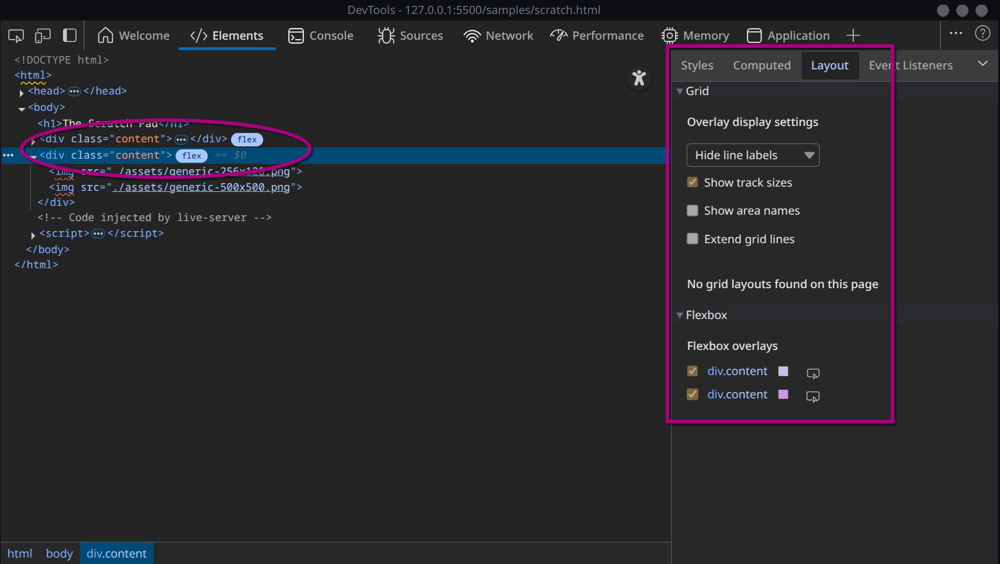
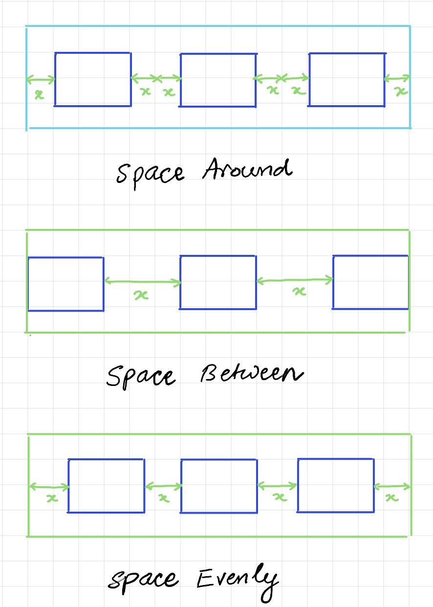
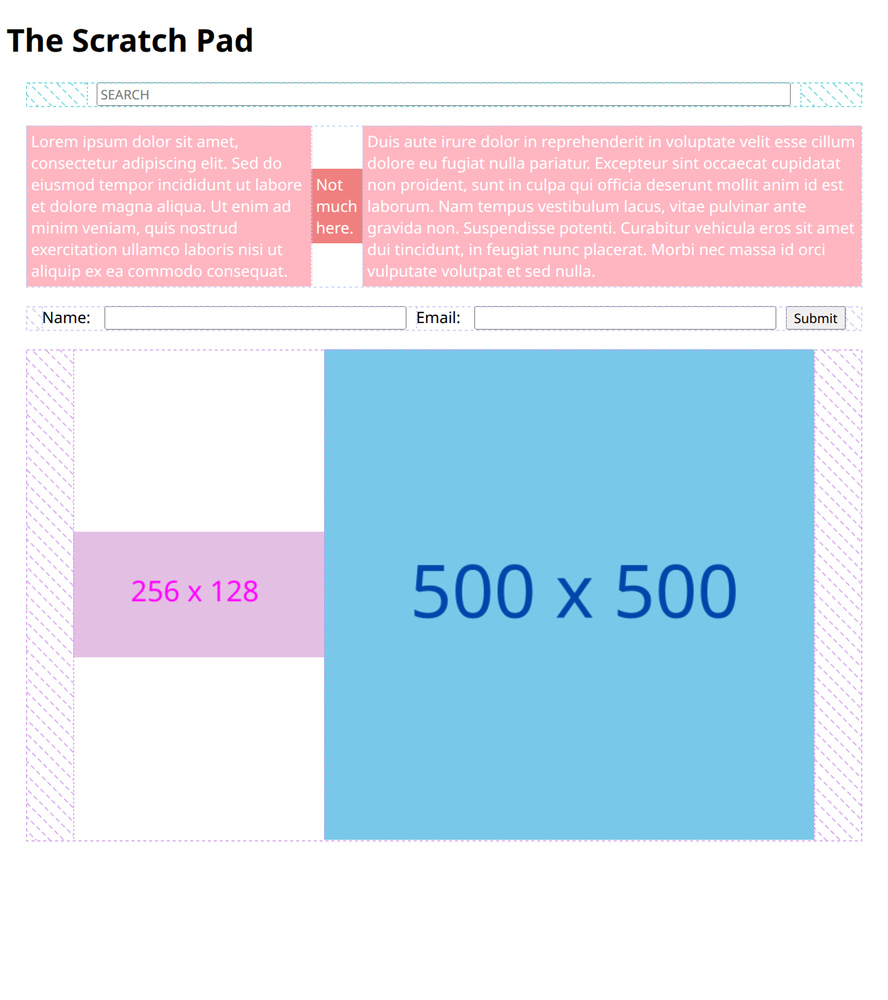
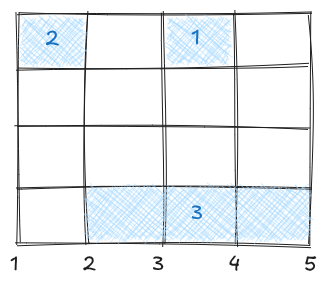
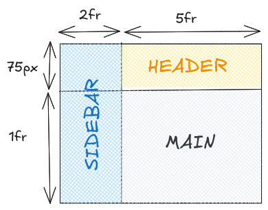

# Layouts

CSS web pages are designed as boxes within boxes overlaid on boxes and so on. The layout is controlled by the `display` property which can have one of the following four values (that I know of) -

* `inline`: Elements are stacked next to each other - in line - along the horizontal axis. 
* `block`: Elements are stacked under each other along the vertical axis because they "block" the entire horizontal space. 
* `flex`: Elements are stacked along the horizontal axis by default.
* `grid`: Grid of cells.

The inline/block set the display on the element itself. The grid/flex set the display on all the children. 

```css
.main {
  display: flex;
}

.red {
  ...
}

.green {
  ...
}

<div class="main">
  <div class="red">...</div>
	<div class="green">...</div>
</div>
```

The `.main` div's display is set to flex, but it itself is still a block div! The child elements, `.red` and `.green` are flex. If I set `.main` to inline, while it itself will turn inline, its children - the `.red` and `.green` divs are not going to turn inline, they'll still be at their default block setting. 

#### Debugging

When I have the DevTools open, I can see the window size of my browser as I resize it. This is useful when testing the responsiveness to different viewport sizes.

I can clearly see the flex/grid layouts if I enable these checkboxes -



## Width and Height

* Default height of a html/body element is the natural height of its content.
* Default width of a html/body element is 100% of the viewport.

By default the height of a html/body element is set to the intrinsic height of its content. This is unlike the width which is set to 100% of the viewport width. Depending on its display style, the content's width will adapt to the viewport width as it is changed. This may or may not change the height of the content. But if I change the height of the viewport, the content will not adapt, it will continue to be at its intrinsic height. I can change this behavior by setting -

```css
html, body { height: 100%; }
```

This will set the height to be 100% of the viewport's height. 

> ⚠️ Unless I have set this explicitly, setting the height of block elements to some %age value will have no effect.

#### `#text`

A bare block of text is special because it cannot have any fixed width set on it. It will always be inside some other element like body, div, p, h, a, button, etc. Its min width is the length of the longest word, its max width is the length of the entire text. It can take on different widths depending on its parent's display style. 

**Inline Parent**

Inline parents cannot have a fixed width, they take on the width of their content. The content, in this case a bare block of text, will take on the width of its first block ancestor. It will be a min-max of the block width, its own min width, and its max width - `min(max_width, max(min_width, block_width))`, more clearly -

```py
if block_width < min_width:
  # if block is smaller than the min-width
  # text will overflow out of its block parent
  text_width = min_width
elif min_width < block_width < max_width:
  # if block is bigger than the min-width but smaller than max-width
  # text will be responsive with soft line breaks
  text_width = block_width
else
	# if block is bigger than the max-width
  # all the text will be in one line
  text_width = max_width
```

**Flex Parent**

A bare text block `#text` with a flex parent will take on the flex-basis width. If flex-basis is set to auto, it will take on its own max-width.

#### Gutter

For both flex and grid, setting the `gap: <int>px` property will create a gutter between consecutive items. It will not create any gaps between the border items and the border.

## Inline & Block & Inline-Block

Usually "visible" elements like buttons, input boxes, anchors, etc. are inline by default. For most inline elements it is not possible to set the height or the width. Margins and paddings only work on the side, i.e., left/right. Top/bottom margins and paddings will be ignored.

> Though I have seen some like images and input boxes where it is possible. 

Their width is whatever is the width of the actual content. Images will default to their actual size, input text boxes will default to 200px, anchors and buttons will take on the width of their text content, etc. If the viewport width is wide enough, the elements will be placed one after the other along the horizontal axis. Otherwise they will start overflowing to the next row and so on. I can only nest other inline elements inside inline elements. 

Usually "container" elements like divs, paragraphs, (and headers for some reason) are block by default. The default dims are width: 100%, height: 0%, i.e., width of a block element is the full width of the viewport (it "blocks" the entire horizontal space) and height is content dependent. Consecutive block elements are placed one below the other. If I explicitly set the width of a block element, it will only apply to the container element itself. Child elements will keep their actual widths and will overflow out of the container if needed. For example, if the container width is smaller than the #text's min-width, the text will overflow out of the container, if I have a 700px input box inside a 400px div, the input box will escape out of the container.

If I change the display of inline elements to block, they will behave like fixed-width block elements, i.e., they will maintain their actual width, but will be placed one below the other. If I change the display of block elements to inline, they will take the width of their children. Any explicit width I had set on the containers will be lost! 

>  ⚠️ IMO - it is best to avoid changing the default display of block to inline or vice-versa. I should consider using flexbox or grid in such situations.

There is a third type of display called `inline-block` where the items are placed side-by-side but I can mess around with the surrounding white space.

## Flex

Flex makes it easy to make block elements inline. Flex will try to put all the elements one after the other on the horizontal axis (aka the primary axis) without the elements overflowing out of the container. For this, it needs a "desired" width for each element, and further how to grow/shrink the element as it tries to fit everything in the container. Of course, it will let the elements overflow beyond the width if it cannot meet my constraints. 

I need to set the container display style to flex (remember that the container itself is still block, only the immediate children will be flex), and then set the desired width and the grow/shrink policy on each child. The desired width is called the flex-basis.

```css 
.container {
  display: flex;
}

.item {
  flex: [flex-grow: int] [flex-shrink: int] [flex-basis: float][unit]
}
```

### `flex-basis`

This is set on each item in the flexbox. Flex items will behave similar to inline items, in that their width will not span the entire viewport. The difference is that they will not necessarily take on their content's width. The flex item itself can be fixed width or not. It can further have child elements with actual widths of their own. The width that flex items end up taking is sometimes referred to its "natural width".  The default basis value is `auto`. 

A fixed width flex item's natural width will always be its fixed width. For a #text child this works well, it takes on the width of the parent and becomes responsive. For other elements, they will overflow out of the item if their actual width is larger than the item's own fixed width. 

If the flex item does not have its own width, it will either take on the max width of the #text child or the actual width of the child element.

A flex item with basis width will try to keep its basis width, but will expand if needed. For a #text child this works well, the text takes on the basis width and becomes responsive. For other fixed width child elements, the flex item will expand to accomodate a wider child, but will retain its basis width of the child can fit inside. The fixed width child will always keep its own width regardless.

No width child elements with #text child of their own will behave as if the flex item itself had the #text child. This means that fixed width and basis width flex items will give their width to the text, no width flex items will take on the max-width of the text.

While it is common to see basis width flex items having a min-width so they don't shrink too much, it is unusual to set both a fixed width and a basis width, but in case this happens, setting the basis value to `content` will ignore any fixed widths set on itself and will only take the width of the child/content. 

Finally, the basis can be set to 0, this means that the item will only get left over space after all the other items have claimed their natural width.

I can set the basis value to some specific value in terms of pixels, %ages, etc. but **no** fr units.

> 💣 There is a bug in all browsers (Chrome, Edge, Firefox) where if I use `` element with `flex-basis` then they don't behave as I'd expect them to - growing and shrinking based on the basis width. As a workaround I should set the min height and/or min width both to 0. If I'll be using the flex-basis as only height or only width, then just set that min to 0.
>
> ```css
> img {
>   flex-basis: 250px;
>   object-fit: cover;
>   min-height: 0;
>   min-width: 0;
> }
> ```
>
> 

### `flex-grow` & `flex-shrink`

If there is some extra space left over after calculating the natural width of all the flex items, they have the option of growing. Flex items can grow unbounded with the container width. The grow policy is set relative to other flex items. If there are three items and each has a grow value of 1, 2, and 3, then the first item will get 1/5 of the free space, second will get 2/5, and the third will get 3/5. The default grow value is 0.

If there is not enough space to fit all the items as per their natural widths, they have the option of shrinking. However, unlike growing, they cannot shrink unbounded. Flex items with element child can only shrink upto the element's actual width. Flex items with #text child can shrink upto the text's min width. The shrink policy is also set just like the grow policy, relative to other items. The default shrink value is 1.

### Direction

Flex determines the placement of the children along its primary axis. By default this is the horizontal axis, with the vertical axis being the cross-axis. I can change this behavior -

```css
.container {
  display: flex;
  flex-direction: column;
}
```

### Alignment

I can use `margin: auto` to great effect without even getting into the flexbox alignment utilities. If I set the `margin-left: auto;` on a single item then it will be pushed all the way to the right. Anything to the right of this item will also get pushed out to the right.

#### Primary Axis Alignment

I can align items along the primary axis using `justify-content: flex-start | center | flex-end | space-between | space-around | space-evenly`. The default is `flex-start`.



#### Cross Axis Alignment

I can set the alignment of all the items at once using `align-items: flex-start | center | flex-end | stretch | baseline`.  The default is `stretch`. This is why the smaller image was stretched. Or I can align individual items using `align-self`.

This is what happened when both primary and cross axis are center aligned.



### Wrapping

By default the items will stack one after the other, even when I start shrinking. By using the wrapping functionality I can tell the browser to maintain the basis/default size as long as it can by creating multiple primary axes and moving overflow items there. The result is that items will start stacking on top of each other in order to maintain their basis/default sizes. Once I reach a point where there is only one item per row, will the items start to shrink beyond their basis/default size. This can be done using the `flex-wrap: nowrap | wrap` property. The default is `nowrap`. 

If I have set the height for the flexbox, and have end up having multiple rows, the way to control the alignment of these rows is to use the `align-content: flex-start | flex-end | center | stretch | space-between | space-around | space-evenly`. 

### Misc

There is a shorthand for setting both the flex direction and flex wrap -

```css
flex-flow: [row | column] [nowrap | wrap];
```

Setting the grow, shrink, and basis has some more bizarre nuances -

```css
/* equivalent to flex: 1 1 auto; */
flex: auto;

/* equivalent to flex: 1 0 0; */
flex: 1;

/* equivalent to flex: 1 1 200px; */
flex: 200px;

/* equivalent to flex: 0 1 auto; */
flex: initial;
```


An example where it became necessary to use media queries when using flexbox is when all my items are text only. Lets say I have a 3-column layout and I have set the flexbox for each column as follows -

```css
.row {
  display: flex;
  flex-wrap: wrap;
  justify-content: space-between;
}

.col-1 {
  flex: 0 1 20%;
}

.col-2 {
  flex: 0 1 45%;
}

.col-3 {
  flex: 0 1 20%;
}
```

> The three columns do not add upto to 100% so that the content has some room to breathe and the `justify-content` setting can come into affect.

Now, as I narrow the viewport, flexbox will start squeezing the column widths to maintain a semblance of 20%-45%-20% distribution. Only when it cannot squeeze the columns further will one of the columns spill over to the next row. And the min-width of text-only content is the length of the longest word. So the columns will be really narrow just before they spill.  This is not the behavior I typically want. I want the spillover to happen much sooner while the columns are still more than their min-width. In order to get my desired behavior, I have to use media queries to change the flex direction to column at some pre-determined screen size. See `homeworks/fancy` for a full-example.

## Grid

Here is how to specify a basic 2 x 3 grid with each row being 50px in height and each column being 1fr in width. The default number of columns is 1, in case I don't specify any columns. If I don't specify the rows, number of rows is calculated dynamically depending on the number of items.

```css
.container {
  display: grid;
  grid-template-columns: 1fr 1fr 1fr;
  grid-template-rows: 50px 50px;
}
```

I can specify the above grid more concisely as follows -

```css
.container {
  display: grid;
  grid-template: repeat(2, 50px) / repeat(3, 1fr);
}
```

The number of elements in `grid-template-columns` specifies the number of columns, and the value of each element specifies the column width of that column. Similarly for rows, the value specifies the row height. I can of course specify the width and height in %ages, pixel values, or any other length unit as well. **Using fr units makes the grid more responsive.** I can also use `auto` that will fill up the remaining space, also making the grid responsive.

If I have more than six items in my actual container, they will just go onto a new row. The number of columns is a hard constraint, the number of rows seems to be a more of a suggestion. Even if I don't specify any rows, it will simply create a -1 x 2 grid. The only difference is that the row height will be dependent on the item's height.

If I just want to specify the row height without specifying the number of rows, I can say -

```css
.container {
  ...
  grid-auto-rows: 50px;
}
```

I can also make the number of columns dynamic by specifying it as `auto-fit`. 

```css
.container {
  display: grid;
  grid-template-columns: repeat(auto-fit, 200px);
}
```

This will create columns that 200px wide, but the number of columns will depend on the container width. As I change the viewport, the number of columns will change. Furthermore, I can also specify the column width to be a range instead of a single number using the `minmax` function like so -

```css
.container {
  display: grid;
  grid-template-columns: repeat(auto-fit, minmax(200px, 1fr));
}
```

This says each column width should be at a minimum 200px, but if the viewport width is not a multiple of 200, then all the columns should take up equal space.

The `grid-auto-flow` property determines the grid-filling algo that the browser uses. By default it will fill the grid row-by-row. Because of the unequal sizes, it is possible that thare are gaps in the grid. By setting the flow to `dense`, the browser will use a grid-packing algo, where if there is gap and later on it comes across an item that can fit in the gap, it will go ahead and place the item there. Thus items are placed regardless of the how they appear in the HTML source. All landscape mode photos will span 2 cols and all portrait mode photos will span 2 rows. There are a couple of photos that I want to be twice as big as most other photos, so they will span both 2 rows and 2 cols. 

### Alignment

`justify-content` aligns items along the row axis and the `align-content` aligns the items along the column axis. `*-items` aligns items within the cell. `justify-items` will align the contents inside a cell along the row and `align-items` will align them along the column. I can also control the justification inside a specific cell by using `justify-self` and `align-self`.

```css
justify-content: start | center | end | space-between | space-around | space-evenly
align-content:   start | center | end | space-between | space-around | space-evenly
```

Setting `justify-content: stretch` will stretch the content inside the cell. For image cells, this will expand the image width (and maybe its height) as long as there is space to expand. As usual, the image will not shrink to fit inside a small cell, it will just overflow.

### Controlling Content Placement

So far we have seen that each child will be automatically be placed on the first available cell. I can control this placement using this syntax (this follows a 1-based inexing) -

```css
/* Place this at grid[row_idx, col_idx] */
.item {
  grid-column: <col_idx>;
  grid-row: <row_idx>;
}

/* Place this at grid[row_start_tick:row_end_tick, col_start_tick:col_end_tick] */
.item {
  grid-row-start: <row_start_tick>;
  grid-row-end: <row_end_tick>;
  grid-col-start: <col_start_tick>;
  grid-col-end: <col_end_tick>;
}

/* Place this at grid[row_idx, start_tick:end_tick] */
.item {
  grid-column: <start_tick> / <end_tick>;
  grid-row: <row_idx>;
}

/* Place this at grid[start_tick : start_tick + 3, col_idx] */
.item {
  grid-column: <col_idx>;
  grid_row: <start_tick> / span 3;
}

/* Place this at whatever column the grid-filling algo has chosen, but make it span 2 cols worth of space*/
.item {
  grid-column: span 2;
}

/* The above is same as -*/
.item {
  gird-column: auto / span 2;
}
```

I can also use negative tick marks.

Concrete example -

```css
.content {
  display: grid;
  grid-template-columns: repeat(4, 1fr);
  grid-template-rows: repeat(4, 1fr);
}

#item1 {
  grid-row: 1;
  grid-column: 3;
}

#item2 {
  grid-row: 1;
  grid-column: 1;
}

#item3 {
  grid-row: 4;
  grid-column: 2/5;
}
```

Here is what this translates to -



When specifying a specific row/col I need to use the (1-based) index number of the row like in `#item1` and `#item2`, but when specfying a span I need to use the "tick" marks for the start and end of the span like in `#item3`. 

Instead of specifying the start/end of the span, I can just specify the length of the span -

```css
#item4 {
  grid-column: 2 / span 2;
}
```

This is saying that I want the column to start at the 2nd tick mark and span 2 columns.

### Grid Areas

Let say I want the following layout -



I can always declare this using the cell spans along with controlling the number of rows and columns. However, there is an easier, more declarative way of getting this done -

```css
.content {
  display: grid;
  grid-template-columns: 2fr 5fr;
  grid-template-rows: 75px 1fr;
  grid-template-areas:
    'sidebar header'
    'sidebar main';
}

header {
  grid-area: header;
}

#sidebar {
  grid-area: sidebar;
}

main {
  grid-area: main;
}
```

In line 6, I kind of sketch out the layout using ASCII art. I am calling the template sections `sidebar`, `header`, and `main`, but I can call them anything.

Here is another example with a 12 col grid -

```css
.container {
  height: 100%;
  display: grid;
  grid-template: 40px auto 40px / repeat(12, 1fr);
  gap: 3px;
  grid-template-areas:
    "m h h h h h h h h h h h"
    "m c c c c c c c c c c c"
    "m f f f f f f f f f f f"
}

.header {
  grid-area: h;
}

.menu {
  grid-area: m;
}

.content {
  grid-area: c;
}

.footer {
  grid-area: f;
}
```

```html
<div class="container">
  <div class="header">HEADER</div>
  <div class="menu">MENU</div>
  <div class="content">CONTENT</div>
  <div class="footer">FOOTER</div>
</div>
```

I can only define the areas as rectangles. If I wanted to have something like this it won't work.

```css
"m h h h h h h h h h h h"
"m c c c c c c c c c f f"
"m f f f f f f f f f f f"
```

because `f` is not a rectangle.

