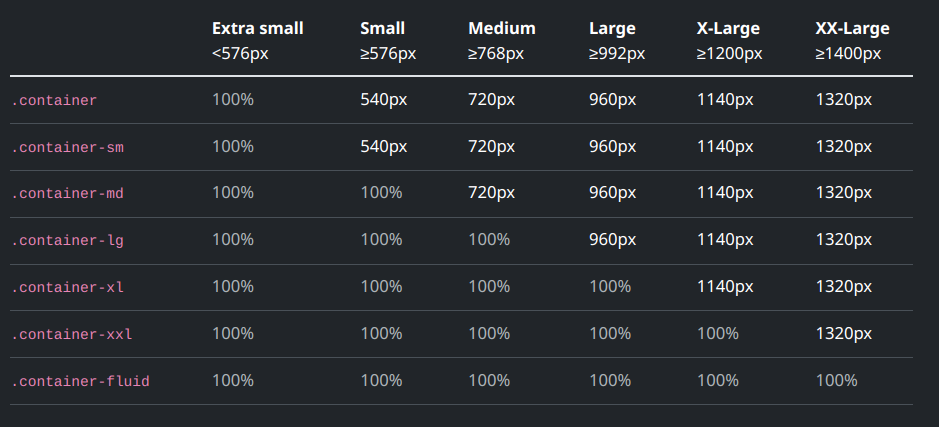

# Web Notes

## Layout

### Breakpoints

All bootstrap styles can be sized based on the the 6 breakpoints it supports -
| Breakpoint        | Class Infix | Dimensions      | iPhone Equivalent                                            |
| ----------------- | ----------- | --------------- | ------------------------------------------------------------ |
| Extra Small       | None        | <576px          | iPhone 3GS                                                   |
| Small             | `sm`        | 576px - 768px   | * iPhone 4 / 4S<br />* iPhone 5 / 5S / 5C<br />* iPhone 6 / 6S<br />* iPhone 7<br />* iPhone 8<br />* iPhone SE (1st, 2nd, 3rd gen) |
| Medium            | `md`        | 768px - 992px   | * iPhone 11<br />* iPhone XR                                 |
| Large             | `lg`        | 992px - 1200px  | * iPhone 6 Plus / 6S Plus<br />* iPhone 7 Plus<br />* iPhone 8 Plus<br />* iPhone 11 Pro<br />* iPhone 12 / 12 Pro / 12 mini<br />* iPhone 13 / 13 Pro / 13 mini<br />* iPhone 14 / 14 Pro<br />* iPhone 15 / 15 Pro<br />* iPhone 16<br />* iPhone X / XS |
| Extra large       | `xl`        | 1200px - 1400px | * iPhone 11 Pro Max<br />* iPhone 12 Pro Max<br />* iPhone 13 Pro Max<br />* iPhone 14 Plus / 14 Pro Max<br />* iPhone 15 Plus / 15 Pro Max<br />* iPhone 16 Plus / 16 Pro / 16 Pro Max<br />* iPhone XS Max |
| Extra extra large | `xxl`       | > 1400px        |                                                              |

#### Representative iPhones

| iPhone Model      | Resolution (W x H) | Bootstrap Breakpoint |
| ----------------- | ------------------ | -------------------- |
| iPhone SE 3rd gen | 750 x 1334         | `sm`                 |
| iPhone XR         | 828 x 1792         | `md`                 |
| iPhone X          | 1125 x 2436        | `lg`                 |
| iPhone 16         | 1179 x 2556        | `lg`                 |
| iPhone 16 Pro     | 1206 x 2622        | `xl`                 |
| iPhone 16 Plus    | 1290 x 2796        | `xl`                 |
|                   |                    |                      |

I can style any component with `.klass-md` and it will apply the the specified style for sizes at or above the `md` breakpoint. Up to that point it will use some default for `.klass`, e.g., if it is `.container` then it will size it to 100% for `sm`, but will size it at whatever size I have given for `md` and above. For most parts if I use the default `.klass` (`.container`, `.col`, etc.) it will change the size automatically with different sizes. 

### [Grid](https://getbootstrap.com/docs/5.3/layout/grid/#row-columns)

I can think of BS layout as a grid of rows and columns. Even though this is called "grid" it is based on the older flexbox style. CSS supports a newer grid style, but that is experimental. For most of my purposes I'll stick to the flexbox style. The hierarchy of components is as follows -

* `.container`
  * `.row`
    * `.column` and `.gutter`
      * my content

#### Containers

Containers center and horizontally pad content. Use `.container` for fully responsive pixel width, `.container-fluid` for `width: 100%` across all viewports, or a responsive container `.container-{breakpoint}` for a combination.

**Rows** are wrappers for columns. Each column  has horizontal padding (called a gutter) for controlling space between them. Rows add a negative margin to align everything nicely. Rows can customized using `.row-cols-*` and `.gutter` classes. E.g., 

```html
<div class="container">
    <div class="row row-cols-2">
        <div class="col">Column</div>
        <div class="col">Column</div>
        <div class="col">Column</div>
       	<div class="col">Column</div>
    </div>
</div>
```

In the above example there are 4 equal sized columns in this row, which means each column would have a span of 3. But the `.row-cols-2` class on the row tells BS that it should have only two columns per row. This results in two rows with two columns each.

#### Columns

Columns are the workhorse class. A page has 12 conceptual columns. I can then set the physical column's width in terms of these default conceptual column widths, e.g., `.col-4` spans 4 conceptual column widths. Use `.col-{n}` for fully responsive columns and `.cols-{breakpoint}-{n}` for combination of full width and fully responsive. If I just use the `.col` class, BS will automatically figure out the column width. E.g., 

```html
<div class="container">
    <div class="row">
        <div class="col">
            1 of 2
        </div>
        <div class="col">
            2 of 2
        </div>
    </div>
</div>
```

Because there are only 2 columns, BS figures out that each has a span of 6. I can even set the width of just one column and BS will figure out the other width automatically.

#### Gutters

are the space between two columns and fully customizable. Change horizontal gutters with `.gx-*` classes, vertical gutters with `.gy-*`, or all gutters with `.g-*` classes. `.g-0` is also available to remove gutters.



#### [Alignment](https://getbootstrap.com/docs/5.3/layout/columns/#alignment)

In general I can use [flexbox alignment utilities](https://getbootstrap.com/docs/5.3/utilities/flex/) which are very similar to usual CSS flexbox. Here is a tl;dr version -

**Vertical alignment** can be changed with the responsive `.align-items-*` classes. To align all the columns the same way, set this on the `.row`, to have different alignments for different columns, set this on each `.col`.

**Horizontal alignment** can be changed with the responsive `.justify-content-*` classes. 
